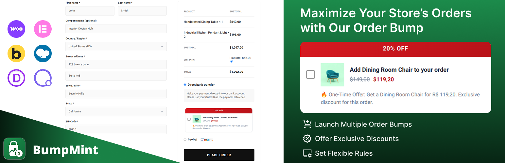
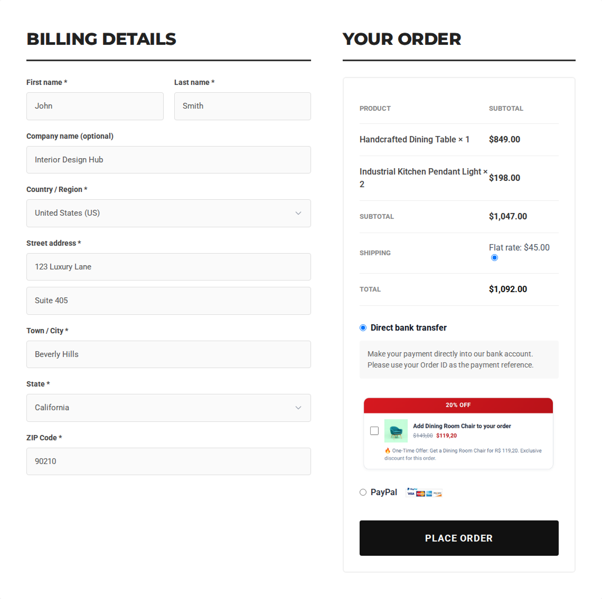
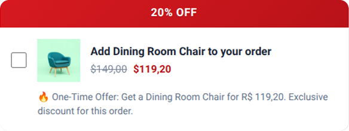
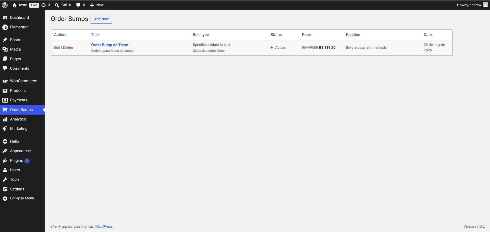
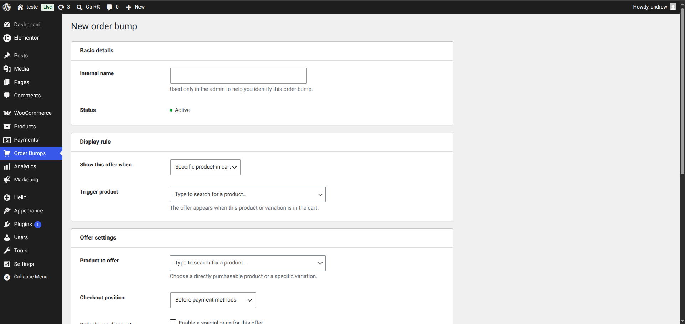
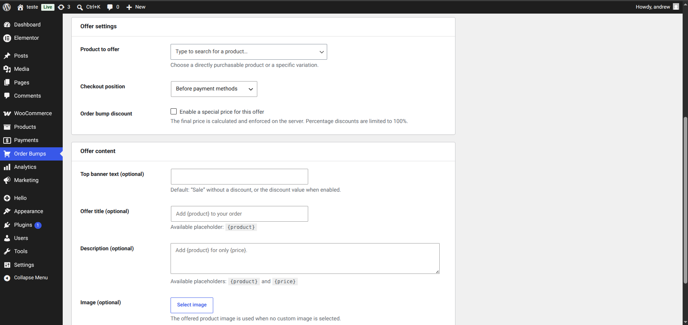

# BumpMint – Order Bump for WooCommerce

BumpMint is a lightweight WooCommerce order bump plugin that lets store owners create targeted, one-click checkout offers with flexible display rules, secure server-side discounts, and multiple positions.

[WordPress.org](https://wordpress.org/plugins/bumpmint-order-bump-for-woocommerce/) · [Report an issue](https://github.com/andrewaires/bumpmint/issues)

## Turn checkout into a smarter revenue opportunity

Present relevant add-ons when customers are ready to complete their purchase. BumpMint makes it easy to create multiple order bumps, target each offer according to the cart, and customize the checkout experience without writing code.

### Highlights

- Launch multiple named order bumps.
- Offer fixed or percentage discounts.
- Limit the discounted quantity of each offered product, with a secure default of one unit.
- Trigger offers by any or all selected products, cart subtotal, item quantity, or show them every time.
- Include multiple separately selectable products in one order bump.
- Optionally hide an offered product when that exact product or variation is already in the cart.
- Position offers before/after order items, before payment, or before the Place order button.
- Customize the banner, product image, title, description, and dynamic placeholders.
- Support simple products and specific purchasable variations.
- Apply discounts to effective WooCommerce prices and validate rules, products, stock, and final prices on the server.
- Keep checkout lightweight, responsive, and synchronized with WooCommerce AJAX updates.
- Ready for community translations through the official WordPress.org translation platform.
- Run with WooCommerce HPOS compatibility.

## Screenshots

### Checkout experience

### Focused one-click offer

### WordPress-native management

### Flexible rules and positioning

### Custom content and secure discounts

## Display rules

BumpMint can show an offer when:

- Any or all selected products or variations are in the cart.
- The classic checkout is displayed.
- The cart subtotal is greater or less than a configured value.
- The cart item quantity is greater or less than a configured value.

Items added by BumpMint are excluded from subtotal and quantity rules so an offer cannot activate or deactivate itself.

## Secure discounts

The browser sends only the saved rule ID, the selected offer product ID, and the requested selection state. BumpMint verifies that the product belongs to the saved rule, resolves its effective WooCommerce price on the server, validates the current condition and stock, calculates the discount, limits the discounted quantity, synchronizes the selected offer, and enforces the trusted price during WooCommerce cart total calculations.

Each rule can hide offered products that are already present in the cart. This check applies independently to each product, while products added through that same bump remain visible so the customer can remove them.

## Requirements

- WordPress 6.5 or newer.
- WooCommerce 8.0 or newer.
- PHP 7.4 or newer.
- WooCommerce classic checkout.

WooCommerce Cart and Checkout Blocks are not currently supported.

## Installation

### From WordPress

1. Open **Plugins > Add New** in your WordPress dashboard.
2. Search for **BumpMint**.
3. Click **Install Now**, then **Activate**.
4. Open **Order Bumps** and create your first offer.

### Manual installation

1. Download the latest ZIP from [GitHub Releases](https://github.com/andrewaires/bumpmint/releases).
2. Open **Plugins > Add New > Upload Plugin**.
3. Upload the ZIP and activate BumpMint.

## License

BumpMint is licensed under the [GNU General Public License v2.0 or later](LICENSE).
